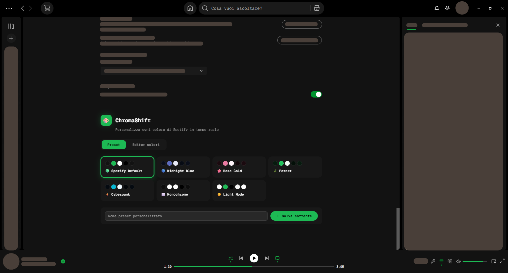

# 🎨 ChromaShift

> Customize every Spotify color from the Settings page — in real time.

ChromaShift is a [Spicetify](https://spicetify.app/) extension that lets you change Spotify's colors without touching any theme files. Everything is done through a clean interface injected right into **Settings**.

<a href="preview.png"></a>

---

## ✨ Features

| Feature | Description |
|---|---|
| **7 Presets** | Spotify Default, Midnight Blue, Rose Gold, Forest, Cyberpunk, Monochrome, Light Mode |
| **13+ color variables** | Text, subtext, backgrounds, highlights, accent, buttons, sidebar, player, cards, notifications |
| **Live preview** | Colors update instantly as you move the picker |
| **Full override** | Overrides both legacy `--spice-*` and modern `--encore-*` Spotify tokens |
| **Persistent** | Colors are saved via `Spicetify.LocalStorage` and applied on every launch |
| **Export / Import** | Share your theme as a `.json` file |
| **AutoUpdater CHecker** | Extension auto check new updates |

---

## 📦 Installation

### Via Spicetify Marketplace (recommended)
1. Open Spotify with Spicetify installed
2. Click the **Marketplace** icon in the top bar
3. Search for **ChromaShift**
4. Click **Install**

### Manual
```bash
# macOS / Linux
cp chromashift.js ~/.config/spicetify/Extensions/
spicetify config extensions chromashift.js
spicetify apply

# Windows (PowerShell)
cp chromashift.js "$env:APPDATA\spicetify\Extensions\"
spicetify config extensions chromashift.js
spicetify apply
```

---

## 🎨 Customizable colors

### Text
- **Main text**
- **Subtext**

### Backgrounds
- **Main background**
- **Elevated background**
- **Hover / selection**
- **Elevated hover**

### Accent & Buttons
- **Accent color**
- **Primary button**
- **Disabled button**

### Structure
- **Sidebar**
- **Player bar**
- **Cards**
- **Notifications**

### & more

---

## 🔧 How to use

1. Scroll to the **ChromaShift** section at settings page
2. Pick a **preset** or click any color circle to open the picker
3. Colors update **live** as you drag the picker
4. Click **Save & Apply** to persist your changes

---

## 📤 Export / Import themes

- **Export**: click "Esporta tema" — JSON is copied to your clipboard
- **Import**: click "Importa tema" — select any `.json` file exported previously

---

## 🛠 Technical notes

ChromaShift overrides:
- All `--spice-*` CSS variables (Spicetify legacy theming layer)
- All `--encore-base-color-*` tokens (Spotify's Encore design system base)
- All `--encore-color-*` semantic tokens
- Specific hardcoded element selectors where Spotify ignores CSS variables

This ensures changes apply to every visible element in the UI.

---

## 🤝 Contributing

PRs welcome! If you've created a great color scheme, open a PR to add it as an official preset and if you want your name will be added to the preset list.

## 🐛 Bug or Request?

Open a issue

# 📷 Screenshot
<table>
  <tr>
    <td></td>
    <td></td>
    <td></td>
    <td></td>
  </tr>
</table>

<table>
  <tr>
    <td></td>
    <td></td>
    <td></td>
    <td></td>
  </tr>
</table>

---
[](https://github.com/stefaceriani/chromashift/releases)
[](https://github.com/stefaceriani/chromashift/fork)
[](https://github.com/stefaceriani/chromashift/commit/)
[](https://github.com/stefaceriani/chromashift/issues)
[](https://github.com/stefaceriani/chromashift/pulls)
[](https://open.spotify.com)
[](https://spicetify.app)
[](https://spicetify.app/docs/)
[](https://github.com/stefaceriani/chromashift/issues)
[](https://github.com/stefaceriani/chromashift/issues)
